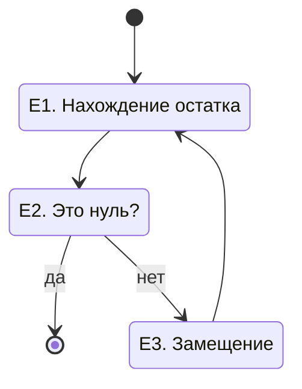

---
### Основы алгоритмизации

§ 2.1 Алгоритмы и исполнители
	2.1.1 Понятие алгоритма
	2.1.2 Исполнитель алгоритма
	2.1.3 Свойства алгоритма
	2.1.4 Возможность автоматизации деятельности человека

---
Алгоритмом называется набор инструкций для выполнения некоторой задачи. 

---
- _Кнут_, _Дональд Эрвин_. _Искусство программирования_, том 1. Основные алгоритмы, : Пер. с англ. : «ООО И.Д. вильямс», 2018. 720 с. : ил.

- Бхаргава А. Грокаем алгоритмы. Иллюстрированное пособие для программистов и любопытствующих. — СПб.: Питер, 2017. - 288 с. : ил.

Note: Эти книги предназначены для читателей, которые владеют азами программирования и хотят разобраться в алгоритмах. Может быть, вы уже столкнулись с задачей программирования и пытаетесь найти алгоритмическое решение.

---
Способы записи алгоритмов:
- текстовый
- блок-схема
- псевдокод
---


Note: алгоритм нахождения наименьшего общего кратного, или алгоритм Евклида. Решение математической задачи в несколько действий. Кулинарный рецепт.
и попросить дать определение:
1. Алгоритм это последовательность действий.
2. Алгоритмы описывают последовательности выполнения простых действий для достижения сложных целей. 
3. Алгоритмы нужны для описания. Любая системная деятельность требует осмысления и описания.

затем установить ключевые характеристики алгоритма:

---
1. Алгоритм пишется для конкретного исполнителя, поэтому не допускает множественности трактовок.

Note: Деятельность бывает двух видов — творческая, когда ищешь когда еще нет готовой схемы действия, и формальная, записанная которая появляется, когда уже достигнуто определённое творческое мастерство. Свойство определённости

---
2.  
---
Note: Давайте попробуем составить Алгоритм уборки в прихожей, чтобы это было понятно младшему брату. С чего мы начинаем уборку?
1. Поставить обувь на полку;
2. Подмести пол;
3. Помыть пол.

Алгоритм предполагает конечное число конкретно описанных действий, однозначно понимаемых исполнителем. для достижения определённой цели.

Одни и те же цели могут быть по разному достигнуты. 

Тема след. занятия: понятие «О-большое» — время выполнения алгоритма.


---
Игра загадай число иллюстрирует алгоритм бинарного поиска.
note: [[Грокаем_алгоритмы.pdf#page=23]]

---
```python [1|2|3|4|5|6|7-8|9]
def col(n):
    sp = [n]
    if n < 1:
        return []
    while n > 1:
        if n % 2 == 0:
            n = n // 2
        else:
            n = 3 * n + 1 
        sp.append(n)
    for i in sp:
        print(i, end = ' ')

col(int(input()))
```
Note: Давайте разберём что за действия приведены тут, как эта программа работает?
1. оператор def задаёт функцию с названием f(x) f в данном случае — последовательность Коллатца.
2. Цикл while будет выполнятся до тех пор, пока х не равен единице. 2list.append Добавляет указанный элемент в конец списка. list.append(x) x : Элемент, который требуется добавить в список.
3. Условие которое звучит так: если остаток от деления числа х на 2 больше 0 двоеточие
4. Присвоение 
5. Добавление в список
6. Иначе, обратите внимание на уровень вложенности. Задаётся клавишей tab, позволяет удобнее читать код.
7. Если остаток от деления числа х на два больше  нуля
Подробнее — Бхаргава А. Грокаем алгоритмы. Питер, 2017. с. 40

---
```python
my_list = []    
my_list.append(1)    
my_list  # [1]    
my_list.append(3)    
my_list  # [1, 3]
```
Note: В python есть следующие структуры данных: 
- список, 
- кортеж, 
- словарь. 
Для добавления множества элементов используйте [extend()](https://pythonz.net/references/named/list.extend/)
