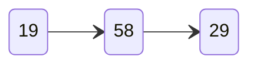

В информатике принято выделять эти понятия. Они относятся к области объектно-ориентированного программирования. Что значит Объект? с. 66

---
Семакин И. Г. Информатика. 8 класс : учебник / И. Г. Семакин, Л. А. Заголова, С. В. Русаков, 

