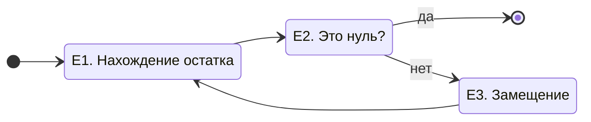

Приветствие. 
---

---
Кулинарный рецепт.
- [ ] Решение математической задачи в несколько действий. 

и попросить дать определение:
1. Алгоритм это последовательность действий.
2. Алгоиритмы описывают последовательности выполнения простых действий достижения более сложных целей. 
3. Алгоритмы нужны для описания. Любая системная деятельность требует осмысления и описания.

затем установить ключевые характеристики алгоритма:

1. Алгоритм пишется для исполнителя, поэтому не допускает множественности трактовок.

Деятельность бывает двух видов — творческая, когда ищешь когда еще нет готовой схемы действия, и алгоримизованная, записанная которая появляется, когда уже достигнуто определённое творческое мастерство.

Давайте попробуем составить Алгоритм уборки в прихожей, чтобы это было понятно младшему брату. С чего мы начинаем уборку?
1. Поставить обувь на полку;
2. Подмести пол;
3. Помыть пол.

Алгоритм предполагает конечное число конкретно описанных действий, однозначно понимаемых исполнителем. для достижения определённой цели.

Одни и те же цели могут быть по разному достигнуты. 

Тема след. занятия: понятие «О-большое» — время выполнения алгоритма.
