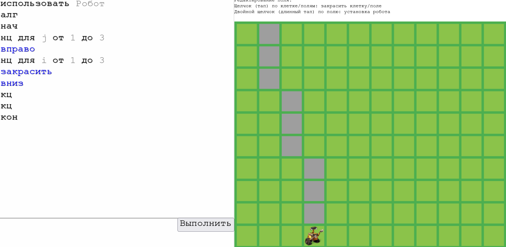
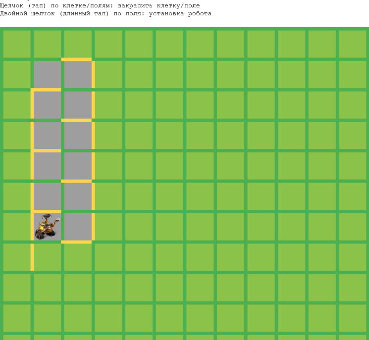

# Алгоритмическая конструкция «повторение»

---

note: # Разбираем ранее решённые задания показываю, что задание 159а решается при помощи вложенного цикла. Класс открывает систему КуМир, раздел цикл N раз пишем простой цикл -- 3 раза вниз, осознаём сколько раз над....

---

