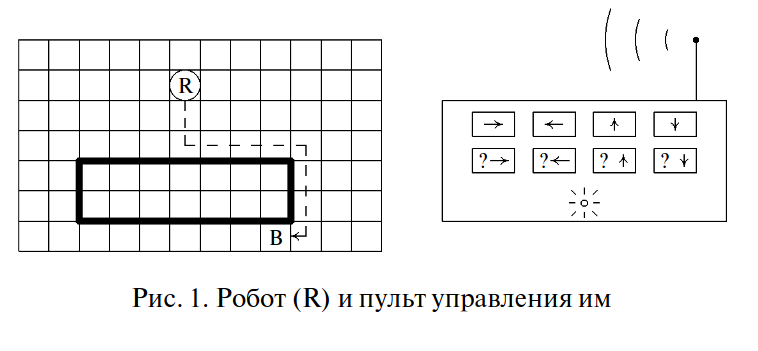

# 24.Переменные. Оператор присваивания
## Повторение пройденного

note: Мы поиграли в робота и поняли различие между режимом непостредственного управления и програмным управлением. И теперь должны перейти от действий над объектами к их **записи** — командам и  величинам.

Мы можем начать с устройства ЭВМ. Как вызнаете, машина состоит, в основном, из процессора и памяти. Процессор выполняет действия, память хранит информацию об объектах и величинах, с которыми работает процессор. Все остальное (принтер, экран, дисковод и пр.) отличается от Робота только системой команд. Устройству дается команда, оно ее выполняет. 

Запишем определение — СКИ это ... с. 49

А вот процессор с памятью — это особые, фундаментальные компоненты ЭВМ. Им соответствуют два фундаментальных свойства ЭВМ — умение **выполнять** действия и умение **хранить** информацию в памяти машины.

# Новый материал
Применяю методику [«Не оправдываться».](./pdf/lemov.pdf)
— Этот материал действительно значим и важен именно потому, что он сложный и изучать его трудно,  но когда вы начнете это понимать, данная тема покажется вам захватывающей и увлекательной. 
Откроем [с. 63](./pdf/8_kl_bosova.pdf)

# Практическая часть
Поиграть в чёрные ящики
Попрактиковаться в решении задачи присваивания